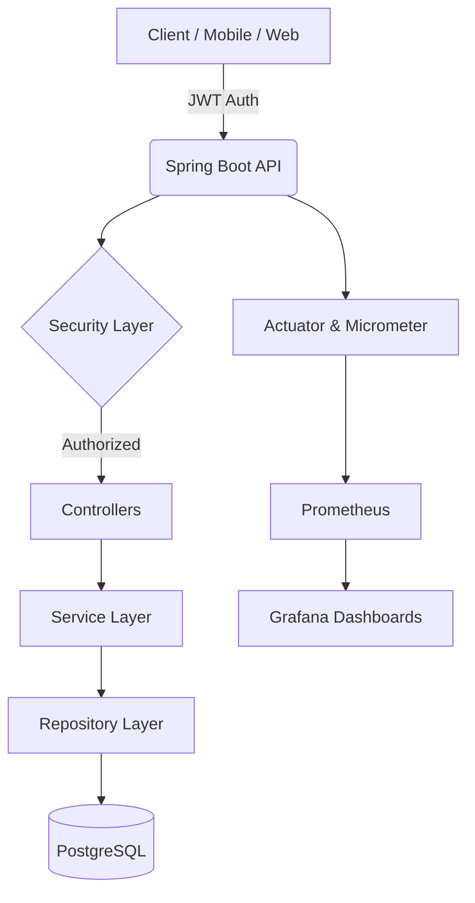

# 📦 Marketplace Core API

[](https://spring.io/projects/spring-boot)
[](https://www.oracle.com/java/)
[](https://www.postgresql.org/)
[](https://www.docker.com/)
[](LICENSE)

A high-performance **Marketplace Core Backend** built with **Spring Boot 3**. This system serves as the foundational engine for catalog management, customer relationship handling, and order lifecycle orchestration, emphasizing security, scalability, and observability.

---

## 🏗️ Technical Architecture

The project follows a **Layered Architecture** with a clear separation of concerns, ensuring maintainability and testability.



### 🎯 Design Principles
- **DDD-Lite**: Domain models and services encapsulate business logic.
- **DTO Pattern**: Decoupling internal entities from API responses using MapStruct.
- **Optimistic Locking**: Handling concurrent updates in the product catalog via `@Version`.
- **Stateless Auth**: Secure session management using JWT and Refresh Tokens.

---

## 🚀 Core Services

- **🔐 Security Service**: Full OAuth2-style flow with JWT, Refresh Tokens, and Role-Based Access Control (RBAC).
- **📦 Catalog Service**: Sophisticated product management with inventory tracking and concurrency control.
- **👥 Customer Service**: Comprehensive customer data management and history.
- **🛒 Order Service**: Multi-item order processing with transactional integrity and referential constraints.
- **📊 Observability Stack**: Production-grade monitoring with Prometheus metrics and Grafana visualizations.
- **🧪 Quality Assurance**: 
  - **Unit Testing**: 90%+ coverage for business logic with Mockito.
  - **BDD Integration**: Gherkin scenarios (Cucumber) executed against real PostgreSQL instances via **TestContainers**.
- **🔄 Schema Migration**: Version-controlled database evolution using **Flyway**.

---

## 🛠️ Tech Stack

| Category | Technology |
| :--- | :--- |
| **Backend** | Java 17, Spring Boot 3.3, Spring Security, Spring Data JPA |
| **Database** | PostgreSQL 15, Flyway, HikariCP |
| **Security** | JSON Web Token (JWT), BCrypt |
| **Observability** | Micrometer, Prometheus, Grafana, Spring Actuator |
| **Testing** | JUnit 5, Mockito, Cucumber, TestContainers, AssertJ |
| **API Doc** | OpenAPI 3 (Swagger UI) |
| **Infrastructure** | Docker, Docker Compose |

---

## 📁 Project Structure

```text
src/main/java/code/vanilson/marketplace/
├── config/           # Security & Bean Configurations
├── controller/       # REST Endpoints (Auth, Products, Orders)
├── dto/              # Data Transfer Objects
├── exception/        # Global Exception Handling & Custom Errors
├── mapper/           # Entity-DTO Mapping (MapStruct)
├── model/            # JPA Entities & Domain Models
├── repository/       # Data Access Layer
└── service/          # Business Logic Implementation
```

---

## 🚦 Getting Started

### 📋 Prerequisites
- **Docker & Docker Compose**
- **Java 17+** (for local development)
- **Maven 3.8+**

### 🐳 Quick Start (Docker)

1. **Clone & Navigate**:
   ```bash
   git clone https://github.com/edsonwade/MarketplaceAPI.git
   cd MarketplaceAPI
   ```

2. **Configure Environment**:
   ```bash
   cp .env.example .env  # Ensure .env exists with correct values
   ```

3. **Launch Stack**:
   ```bash
   docker-compose up -d --build
   ```
   *Services will be available at:*
   - **API**: `http://localhost:8081`
   - **Swagger UI**: `http://localhost:8081/swagger-ui.html`
   - **Grafana**: `http://localhost:3000` (admin/admin)

---

## 📡 API Usage Examples

### 🔐 1. Authentication
**POST** `/api/v1/auth/register`
```json
{
  "firstname": "John",
  "lastname": "Doe",
  "email": "john.doe@example.com",
  "password": "securePassword123",
  "role": "ADMIN"
}
```

### 🛍️ 2. Manage Catalog
**POST** `/api/products` (Requires JWT Header)
```json
{
  "name": "High-End Processing Unit",
  "quantity": 15
}
```

### 🛒 3. Process Transaction
**POST** `/api/orders`
```json
{
  "customerId": 1,
  "orderItems": [
    { "productId": 1, "quantity": 2 },
    { "productId": 3, "quantity": 1 }
  ]
}
```

---

## 🧪 Testing Strategy

The project employs a robust testing methodology to ensure zero-regression:

### 🔹 Behavior Driven Development (BDD)
We use **Cucumber** to bridge the gap between business requirements and technical implementation.
```gherkin
Scenario: Create a new Product - Success
  Given a new product with details
    | name  | quantity |
    | Chair | 50       |
  When I save the product
  Then the product should be saved with status 201
```

### 🔹 Integration Testing
**TestContainers** spins up a disposable PostgreSQL container for every test suite execution, ensuring tests run against a real database environment.

Run all tests:
```bash
mvn clean test
```

---

## 📊 Monitoring & Metrics

Leveraging the **Prometheus + Grafana** stack, the API exposes:
- **JVM Metrics**: Heap usage, thread count, GC activity.
- **HTTP Metrics**: Request latency, error rates per endpoint.
- **Database Metrics**: Connection pool saturation (HikariCP).
- **Health Checks**: `/actuator/health` for Liveness/Readiness probes.

---

## 👥 Contributing

1. Fork the Project
2. Create your Feature Branch (`git checkout -b feature/AmazingFeature`)
3. Commit your Changes (`git commit -m 'Add AmazingFeature'`)
4. Push to the Branch (`git push origin feature/AmazingFeature`)
5. Open a Pull Request

---

## 📝 License

Distributed under the MIT License. See `LICENSE` for more information.

Developed with ❤️ by [Vanilson Muhongo](https://github.com/edsonwade) 🚀

